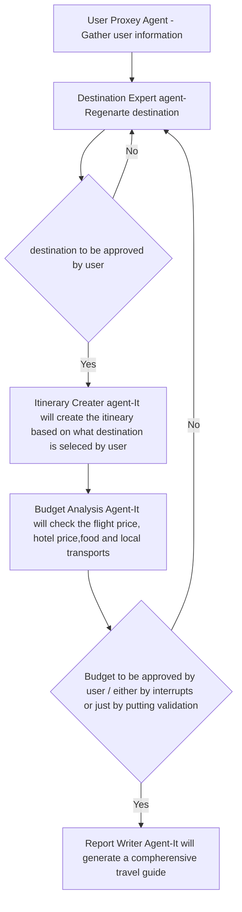

```mermaid

flowchart TD
 A[User Proxey Agent - Gather user information] --> B[Destination Expert Agent Suggests the destination cities/places based on user preferences]
 B --> C{destination to be approved by user}
 C -->|Yes| D[Itinerary Creater agent-It will create the itineary based on what destination is seleced by user]
 C -->|No| B[Destination Expert agent -Regenarte destination]
 D --> E[Budget Analysis Agent-It will check the flight price, hotel price,food and local transports]
 E --> F{Budget to be approved by user / either by interrupts or just by putting validation}
 F --> |Yes| G[Report Writer Agent-It will generate a compherensive travel guide ]
 F -->|No| B[ Destination Expert agent-Regenarte destination]

```